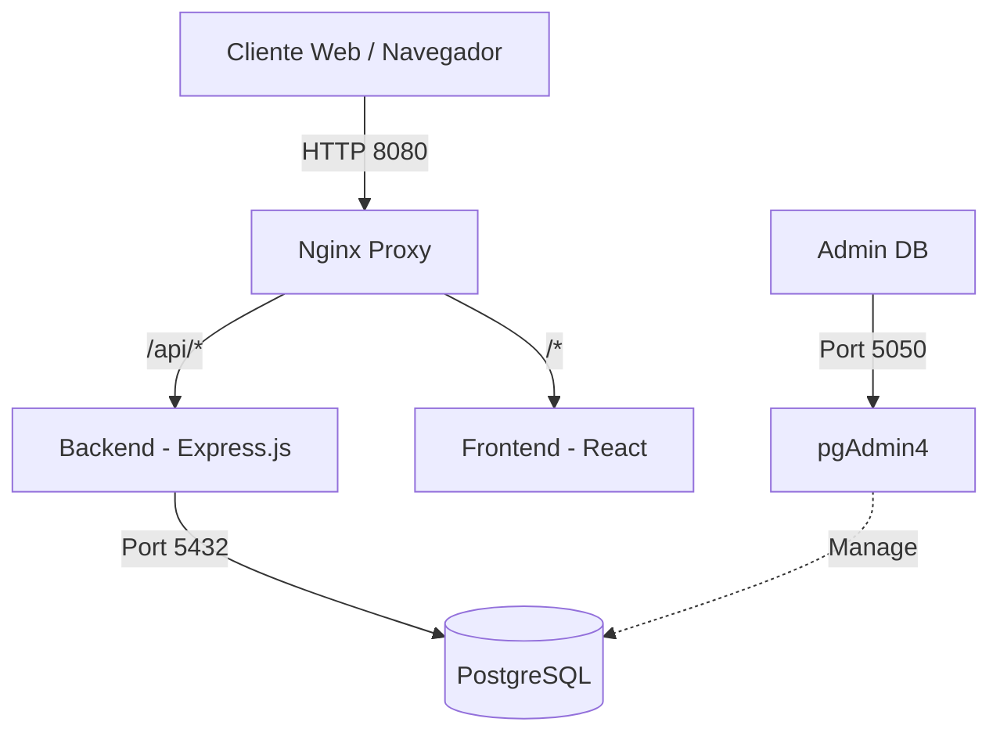

# 📦 OmniStock - Sistema de Gestión de Inventarios


OmniStock es una plataforma web de nivel empresarial diseñada para la gestión eficiente de inventarios. Desarrollada bajo una arquitectura limpia y contenerizada, ofrece un control de acceso basado en roles (RBAC), métricas analíticas en tiempo real y trazabilidad completa de movimientos.

---

## 📑 Tabla de Contenidos

- [Características Principales](#-características-principales)
- [Arquitectura del Sistema](#-arquitectura-del-sistema)
- [Tecnologías](#-tecnologías)
- [Requisitos Previos](#-requisitos-previos)
- [Instalación y Despliegue](#-instalación-y-despliegue)
- [Estructura del Proyecto](#-estructura-del-proyecto)

---

## ✨ Características Principales

- **Dashboard Analítico:** Visualización en tiempo real de KPIs y productos con mayor movimiento usando `Recharts`.
- **Alertas de Stock:** Monitoreo automatizado de productos con existencias críticas (≤ 5 unidades).
- **Seguridad RBAC:** Control de acceso mediante JWT y middlewares de rutas protegidas (Administrador vs Usuario Estándar).
- **Reportes Globales:** Exportación de Kardex y movimientos a formato CSV.
- **Entorno Aislado:** Orquestación completa mediante Podman Compose (API, Web, DB, Proxy, pgAdmin).

---

## 🏗️ Arquitectura del Sistema

El proyecto utiliza un proxy inverso Nginx para enrutar el tráfico de forma transparente, evitando conflictos de CORS y unificando el ecosistema bajo un solo puerto externo.



---

## 💻 Tecnologías

**Frontend:**
- React.js (Vite)
- React Router DOM v7
- Recharts (Data Visualization)
- Axios

**Backend:**
- Node.js & Express.js
- JSON Web Tokens (JWT) para autenticación
- pg (PostgreSQL Client para Node)

**Infraestructura:**
- Base de datos: PostgreSQL 15
- Orquestación: Podman / Docker Compose
- Proxy Inverso: Nginx

---

## ⚙️ Requisitos Previos

Asegúrate de tener instalado el siguiente software en tu máquina local:
- [Node.js](https://nodejs.org/) (v18 o superior) - *Solo para desarrollo local sin contenedores*
- [Podman](https://podman.io/) o [Docker](https://www.docker.com/) con su respectivo plugin de `compose`.
- Git

---

## 🚀 Instalación y Despliegue

1. **Clonar el repositorio:**

   ```bash
   git clone [https://github.com/tu-usuario/omnistock.git](https://github.com/tu-usuario/omnistock.git)
   cd omnistock
   ```

2. **Levantar los contenedores:**
   Las variables de conexión y entorno ya se encuentran preconfiguradas en el archivo `compose.yml` para un despliegue rápido en desarrollo. Solo ejecuta el siguiente comando para construir y levantar toda la infraestructura:

   ```bash
   podman-compose up -d --build
   ```

   *(Si utilizas Docker, reemplaza `podman-compose` por `docker compose`)*

3. **Acceder a la aplicación:**
   - **Plataforma Web:** `http://localhost:8080`
   - **pgAdmin (Gestor de BD):** `http://localhost:5050`

---

## 📁 Estructura del Proyecto

```text
omnistock/
├── backend-express/       # Código fuente de la API REST
│   ├── src/
│   │   ├── controllers/   # Lógica de negocio
│   │   ├── routes/        # Definición de endpoints
│   │   └── middleware/    # Validaciones y JWT Auth
│   ├── Dockerfile
│   └── package.json
├── frontend-react/        # Código fuente de la interfaz Web
│   ├── src/
│   │   ├── pages/         # Vistas (Dashboard, Inventario, Usuarios)
│   │   ├── api/           # Configuración de Axios
│   │   └── App.jsx        # Enrutamiento principal
│   ├── Dockerfile
│   └── package.json
├── nginx/                 # Configuración del proxy inverso
│   └── default.conf
└── compose.yml            # Orquestación de servicios (Podman/Docker)
```

---
*Desarrollado con pasión para la gestión eficiente de recursos.* 🚀
